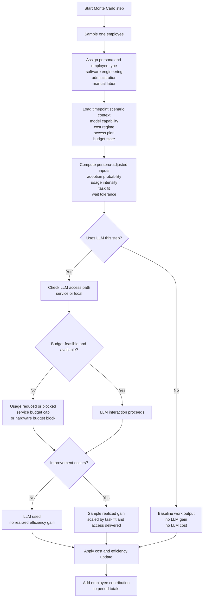
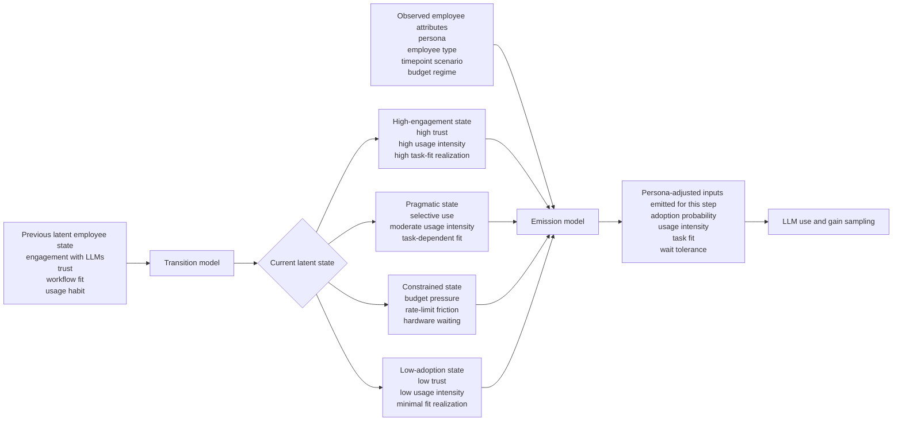
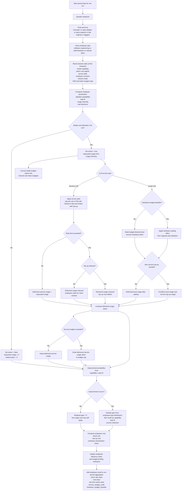

# LLM Efficiency Return Simulation

Toy Monte Carlo simulation for time-dependent LLM efficiency return-rate curves.

The model simulates 500 users by default over 3 years at quarterly resolution. It assigns each user to one of five adopter personas, simulates LLM adoption and realized productivity gain, applies model capability and cost scenarios, and then fits efficient return-rate curves to the simulated data.

## Installation

Create a virtual environment and install the dependencies:

```bash
python -m venv .venv
source .venv/bin/activate
pip install -r requirements.txt
```

## Run

```bash
python simulate_llm_efficiency.py
```

Useful options:

```bash
python simulate_llm_efficiency.py \
  --users 500 \
  --years 3 \
  --resolution-months 3 \
  --runs 1000 \
  --concurrency 4 \
  --employee-mix software_engineering=0.36,administration=0.44,manual_labor=0.20 \
  --max-monthly-service-budget-usd 15000 \
  --max-upfront-hardware-budget-usd 775000 \
  --backend numpy
```

Optional Apple GPU path, if PyTorch with MPS support is installed:

```bash
python simulate_llm_efficiency.py \
  --backend torch-mps \
  --runs 1000
```

Budget sweep wrapper:

```bash
python sweep_budget_frontier.py \
  --years 3 \
  --runs 200 \
  --total-budget-usd 1200000 \
  --service-budget-max-usd 15000 \
  --service-budget-points 5 \
  --hardware-budget-max-usd 775000 \
  --hardware-budget-points 5
```

Render the README to PDF with Mermaid support:

```bash
python render_readme_pdf.py --output README.pdf
```

For wide Mermaid diagrams, the most useful options are:

```bash
python render_readme_pdf.py --output README.pdf --landscape --diagram-scale 0.9
```

Outputs are written to `outputs/`:

- `monte_carlo_results.csv`: run-level time series for all scenarios.
- `scenario_summary.csv`: mean, p05, p50, p95 summaries per scenario and time point.
- `fitted_return_rate_curves.csv`: spline-fitted return-rate curves.
- `plots/fitted_return_rate_curves.png`
- `plots/cost_per_efficiency_increment.png`
- `plots/risk_return_2d_slices.png`
- `plots/risk_return_2d_slices_by_llm_access.png`
- `plots/risk_return_2d_slices_all_months.png`
- `plots/risk_return_2d_slices_all_months_by_llm_access.png`
- `plots/revenue_risk_time_3d.png`
- `plots/revenue_risk_time_3d.html`, if Plotly export works.

The budget sweep wrapper writes:

- `budget_frontier_selections.csv`
- `budget_frontier_points.csv`
- `budget_frontier_grid.png`
- `budget_frontier_contours.png`

## Metrics

The base efficiency index is `1.0`. A realized gain of `0.12` means the user's simulated output index is `1.12`.

The main return metric is:

```text
return_rate = mean_efficiency_gain_per_person / total_cost_index_per_person
```

The inverse metric is also reported:

```text
cost_per_efficiency_increment = total_cost_index / total_realized_efficiency_gain
```

No monetary salary value is used for productivity. Costs are computed internally in arbitrary cost-index units. The current API cost for one active user in one quarter is normalized to `1.0`.

Budget inputs can be given in either dollars or internal cost-index units:

- `--max-monthly-service-budget-usd` is a monthly cap in USD.
- `--max-upfront-hardware-budget-usd` is an upfront capex budget in USD.
- `--max-monthly-service-budget` is the same service cap directly in internal cost-index units.
- `--max-upfront-hardware-budget` is the same hardware cap directly in internal cost-index units.

The USD inputs are converted into the internal cost-index scale using explicit calibration parameters:

- `--usd-per-service-cost-index-quarter`, default `60.0`
- `--usd-per-hardware-capex-index`, default about `41.20`

With the defaults:

- `1.0` service cost-index unit per active user per quarter corresponds to `$60`
- `1.0` hardware capex index unit corresponds to about `$41.20`
- the `onprem_10pct_capacity` scenario with `maxed_out` corresponds to about `$6,798` upfront

The internal index scale remains the simulation's native accounting layer. The dollar inputs are a convenience mapping on top of it.

The 3D plot uses:

- x: time in months
- y: risk
- z: return rate

Risk follows the finance-style volatility idea requested here: the standard deviation of scenario return-rate changes observed up to the simulated point in time. It is computed per Monte Carlo run and then summarized across runs.

## Model Assumptions

### Personas

The adopter personas are:

- innovators
- early adopters
- early majority
- late majority
- laggards

The split uses the classic Rogers diffusion categories often applied in SME technology adoption literature:

- innovators: 2.5%
- early adopters: 13.5%
- early majority: 34%
- late majority: 34%
- laggards: 16%

Each persona has different baseline adoption probability, task fit, usage intensity, and willingness to wait for on-prem hardware access.

### Productivity Gains

Three employee types are simulated:

- software engineering, default share 36%
- administration, default share 44%
- manual labor, default share 20%

Mean productivity gain assumptions are deliberately conservative for a toy model:

- software engineering: mean gain 10.0%, with noise, as the mixed-context default
- administration: mean gain 17.0%, with noise
- manual labor: mean gain 2.0%, with noise, reflecting modest support for email and knowledge lookup rather than core work execution

The employee-type mix is configurable through `--employee-mix`.

Software engineering also has a configurable context prior through `--engineering-context`:

- `mixed`: the default blended case, centered at 10%
- `bounded`: bounded or greenfield enterprise tasks, centered at 20%
- `maintenance`: mature-codebase maintenance work, centered at -2.5%

This reflects the newer literature showing positive gains in bounded enterprise tasks but possible slowdowns for experienced developers in high-context maintenance work.

The model samples realized gains around those means, then gates them through:

- whether the user adopts the tool at that time point
- whether the use actually improves output
- the user's persona/task-fit multiplier
- the model capability multiplier
- waiting reduction if on-prem hardware capacity is constrained
- waiting reduction if a flat-rate access window is exhausted and top-up is not enabled

### Model Capability Scenarios

Four model-access scenarios are included:

- `frontier_growth`: frontier models continue to improve over the simulated period.
- `frontier_plateau`: frontier models plateau after `--plateau-quarter`.
- `oss_growth_lagged`: open-source models follow the growth path with a three-quarter lag and lower starting capability.
- `oss_plateau_lagged`: open-source models follow the plateau behavior with the same lag.

The default quarterly frontier capability improvement is 8.5%, capped at 2.6x. That is a stylized assumption, not a forecast.

### Token Cost Scenarios

Three token/API cost scenarios are included:

- `flat`: effective token costs stay flat.
- `gradual_break_even`: costs rise gradually toward a higher break-even level.
- `sudden_break_even`: costs jump early in the simulation.

These are implemented as cost-index multipliers. They are not forecasts of exact provider pricing.

### LLM Access Plans

Three access plans are simulated:

- `pay_per_use`: existing behavior; all delivered usage is charged at the active token-cost scenario.
- `flatrate_limited`: active users pay a fixed flat-rate cost-index charge, but usage is capped by both a 5-hour-window allowance and a weekly allowance. If either allowance is exhausted, the excess requested usage is lost to waiting until the window resets.
- `flatrate_limited_topup`: same flat-rate limits, but excess requested usage is restored through top-up usage charged at the same pay-per-use token cost as the active token-cost scenario.

The access-limit model is aggregate and normalized to the simulation time step. It does not simulate exact message timestamps inside each 5-hour or weekly window. The output CSVs include `delivered_usage_share`, `rate_limit_exhausted_share`, and `topup_cost_index`.

### Budget Constraints

Two optional budget controls are available:

- `--max-monthly-service-budget-usd`: caps service spending per calendar month in USD. The simulator converts that to the internal time-step budget, and if projected service spend exceeds it, delivered service usage is scaled down proportionally.
- `--max-upfront-hardware-budget-usd`: caps upfront hardware purchase cost in USD. If a hardware scenario exceeds this cap after conversion into the internal scale, the local-hardware effect is removed for that scenario and no hardware cost is applied.

For direct control of the internal accounting layer, the index-unit versions remain available:

- `--max-monthly-service-budget`
- `--max-upfront-hardware-budget`

The output CSVs include `service_budget_scale` and `hardware_budget_feasible` so you can see when a budget limit binds.

For the budget sweep wrapper, the total-budget filter is:

```text
total_lifetime_budget_usd = monthly_service_budget_usd * 12 * years + upfront_hardware_budget_usd
```

Only budget pairs inside that total-budget cap are simulated.

### Hardware Scenarios

Hardware scenarios:

- `cloud_api_only`
- `onprem_10pct_capacity`
- `onprem_50pct_capacity`
- `onprem_full_capacity`
- `onprem_low_30pct_utilization`

Hardware is amortized over 36 months. Two refresh behaviors are included:

- `maxed_out`: hardware is used as bought.
- `follow_each_generation`: higher capex, with a small capability bonus.

The simulation assumes perfect IT setup: no integration losses, security overhead, downtime, networking bottlenecks, or staff cost.

## Source Anchors

The parameters are intentionally approximate. The goal is defensibility, not precision.

Productivity:

- Brynjolfsson, Li, and Raymond, "Generative AI at Work", NBER Working Paper 31161, 2023. Finds average productivity gains around 14% for customer-support agents, with larger gains for less-experienced workers. https://www.nber.org/papers/w31161
- Noy and Zhang, "Experimental Evidence on the Productivity Effects of Generative Artificial Intelligence", Science, 2023. Finds large time savings and quality improvements in professional writing tasks. https://www.science.org/doi/10.1126/science.adh2586
- Paradis et al., "How much does AI impact development speed? An enterprise-based randomized controlled trial", 2024. Reports an estimated 21% reduction in time-on-task for Google software engineers in a bounded enterprise setting, with wide uncertainty. https://arxiv.org/abs/2410.12944
- Becker et al., "Measuring the Impact of Early-2025 AI on Experienced Open-Source Developer Productivity", 2025. Reports a 19% slowdown for experienced developers in mature open-source codebases. https://arxiv.org/abs/2507.09089
- Freeman et al., "Evaluation of Task Specific Productivity Improvements Using a Generative Artificial Intelligence Personal Assistant Tool", 2024. Reports office-task improvements ranging from 3.3% to 69%, strongest for summarization and instructions. https://arxiv.org/abs/2409.14511
- Maier et al., "A meta-analysis of the effect of generative AI on productivity and learning in programming", 2026. Finds a moderate positive average productivity effect in programming with substantial heterogeneity across contexts. https://arxiv.org/abs/2605.04779

Adoption:

- Rogers, "Diffusion of Innovations", 5th edition, 2003. Source of the canonical adopter split used as the persona baseline.
- European Commission SME digitalisation reporting, including DESI/Digital Decade and SME digital intensity discussions, provides the European SME context but not a stable one-to-one split for these personas. The simulator therefore uses the Rogers split as the documented diffusion proxy.

Costs and hardware:

- NVIDIA H100, H200, and Blackwell/B200 product specifications are used as public anchors for the hardware generation assumptions. https://www.nvidia.com/en-us/data-center/
- Public cloud/API market reporting and provider pricing discussions through 2024-2026 motivate the flat, gradual break-even, and sudden break-even token-cost scenarios. The simulation intentionally keeps these as normalized cost-index paths instead of exact provider economics.
- The default hardware dollar calibration is anchored to the `onprem_10pct_capacity` scenario and an inferred RTX 6000 Ada price of about `$6,798`. This is inferred from Tom's Hardware reporting on March 22, 2025 that the RTX Pro 6000 Blackwell was listed at `$8,565`, which was `26%` more than the RTX 6000 Ada. https://www.tomshardware.com/pc-components/gpus/nvidia-rtx-pro-6000-blackwell-gpu-is-listed-for-usd8-565-at-us-retailer-26-percent-more-expensive-than-the-last-gen-rtx-6000-ada

## Simulation Flow

Compact view of one employee-level Monte Carlo step:



Hidden Markov view of the latent employee state that drives the persona-adjusted inputs:



Detailed view including access-plan and hardware branches:



## Implementation Notes

- The default simulation backend is vectorized NumPy across users and periods.
- `--backend torch-mps` uses PyTorch tensors on Apple Metal/MPS for the inner Monte Carlo arrays. It requires `torch` and fails clearly if MPS is unavailable.
- `--backend auto` uses PyTorch/MPS when available and falls back to NumPy otherwise.
- Scenario-level parallelism uses `ThreadPoolExecutor` and is controlled by `--concurrency`. This avoids macOS sandbox semaphore limits while still helping because the numerical work is mostly NumPy-backed.
- `tqdm` reports scenario-level progress during simulation.
- The GPU path is optional. It may only be faster for larger run counts because the simulation still emits pandas rows and writes CPU-side CSV/plot artifacts.
- Matplotlib is configured to write its cache to local `.mplconfig/` because the default user cache path may not be writable in this environment.
- The fitted return-rate curves use SciPy `UnivariateSpline`. This is a descriptive fit to simulated data, not a structural economic model.
- `--employee-mix` lets you rebalance the workforce composition without editing code.

## Constraints

- This is a toy model. The parameters are plausible ranges, not calibrated estimates.
- "Revenue" is expressed as efficiency return per cost-index unit, not money.
- Budget caps are stylized controls, not a treasury model. Service budget pressure is applied as proportional usage reduction, and hardware budget pressure is applied as scenario feasibility.
- The on-prem model excludes installation, staffing, power, cooling, downtime, procurement lead time, and security review.
- Adoption behavior is stylized and should be treated as scenario logic, not empirical prediction.
- The open-source lag is fixed at three quarters by default. That can be changed in code if needed.
