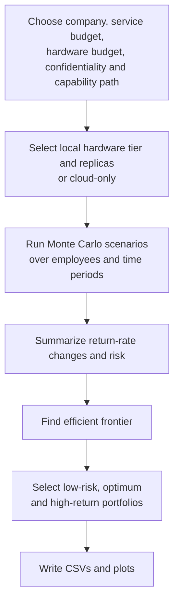
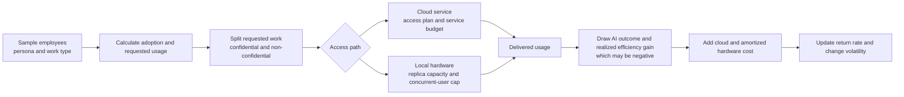

# LLM Efficiency Return Simulation

Toy Monte Carlo simulation for time-dependent LLM efficiency return-rate curves.

The model simulates 500 users by default over 3 years at quarterly resolution. It assigns each user to one of five adopter personas, simulates LLM adoption and realized productivity gain, applies model capability and cost scenarios, and then fits efficient return-rate curves to the simulated data.

All simulation inputs and sweep grids are in [`simulation_config.yaml`](simulation_config.yaml). Each executable accepts `--config PATH` to use a different YAML file, for example `python simulate_llm_efficiency.py --config my_scenario.yaml` or `python sweep_portfolio_rate_changes.py --config my_scenario.yaml`. The file comments give units, source anchors, and suggested sensitivity ranges.

## Installation

Create a virtual environment and install the dependencies:

```bash
python -m venv .venv
source .venv/bin/activate
pip install -r requirements.txt
```

For development, also install the formatter and test dependencies:

```bash
pip install -r requirements-dev.txt
```

If the project Conda environment is available, activate it with
`conda activate cofin` and install `requirements-dev.txt` there before running
the checks.

## Development

Python source is formatted with Black at a 79-column target and isort
multi-line mode 4. The commands operate only on files tracked by Git and must
run in this order:

```bash
git ls-files -z '*.py' | xargs -0 -n 1 black
git ls-files -z '*.py' | xargs -0 isort
git diff --exit-code -- '*.py'
```

Run the regression tests with `pytest -q`. GitHub Actions and GitLab CI run
the formatting check and unit tests on every pushed change. See
[`AGENTS.md`](AGENTS.md) for the repository layout, contribution conventions,
and Slurm operations.

## Run

```bash
python simulate_llm_efficiency.py
```

Useful options:

```bash
python simulate_llm_efficiency.py \
  --users 500 \
  --years 3 \
  --resolution-months 3 \
  --runs 1000 \
  --concurrency 4 \
  --employee-mix software_engineering=0.36,administration=0.44,manual_labor=0.20 \
  --confidential-document-fraction 0.25 \
  --max-monthly-service-budget-usd 15000 \
  --max-upfront-hardware-budget-usd 775000 \
  --hardware-calibration h100 \
  --backend auto
```

Optional explicit backends:

```bash
python simulate_llm_efficiency.py \
  --backend numba \
  --runs 1000
```

```bash
python simulate_llm_efficiency.py \
  --backend torch-mps \
  --runs 1000
```

Stochastic break-even and capability-shock mode:

```bash
python simulate_llm_efficiency.py \
  --stochastic-shocks \
  --sudden-break-even-probability-per-month 0.01 \
  --gradual-break-even-probability-per-month 0.01 \
  --capability-plateau-probability-per-month 0.01 \
  --runs 1000
```

In this opt-in mode the simulator evaluates all eight enabled-shock
combinations: no shocks, each individual shock, each pair, and all three
shocks. Probabilities are interpreted per month and converted to the chosen
simulation resolution. A shock is sampled once per run, remains active after
it occurs, and affects the occurrence period onward. Sudden break-even jumps
token cost to the break-even multiplier; gradual break-even ramps from the
occurrence period to that multiplier by the end of the horizon; and a
capability-plateau shock freezes capability at its occurrence level.

The run-level and summary CSVs include `shock_combination` plus the three
shock-state columns. The summary grouping includes `shock_combination` so
rows remain separated by enabled shock combination.

Budget sweep wrapper:

```bash
python sweep_budget_frontier.py \
  --years 3 \
  --runs 200 \
  --backend auto \
  --concurrency 4 \
  --simulation-concurrency 2 \
  --confidential-document-fraction 0.25 \
  --hardware-calibration rtx6000-blackwell-gemma-moe-26b \
  --total-budget-usd 1200000 \
  --service-budget-max-usd 15000 \
  --service-budget-points 5 \
  --hardware-budget-max-usd 775000 \
  --hardware-budget-points 5
```

Replot existing sweep outputs without resimulating:

```bash
python sweep_budget_frontier.py \
  --replot-only \
  --output-dir budget_sweep_outputs
```

Render the README to PDF with Mermaid support:

```bash
python render_readme_pdf.py --output README.pdf
```

For wide Mermaid diagrams, the most useful options are:

```bash
python render_readme_pdf.py --output README.pdf --landscape --diagram-scale 0.9
```

Render a concise explanation of one simulation period and the persona effects
as a PNG:

```bash
python render_simulation_step_diagram.py --output simulation_step_and_persona.png
```

Render English and German input and static-persona-Markov variants together:

```bash
python render_simulation_step_diagram.py --all-variants --output-dir simulation_diagrams
```

Outputs are written to `outputs/`:

- `monte_carlo_results.csv`: run-level time series for all scenarios.
- `scenario_summary.csv`: mean, p05, p50, p95 summaries per scenario and time point.
- `fitted_return_rate_curves.csv`: spline-fitted return-rate curves.
- `plots/fitted_return_rate_curves.png`
- `plots/cost_per_efficiency_increment.png`
- `plots/risk_return_2d_slices.png`
- `plots/risk_return_2d_slices_by_llm_access.png`
- `plots/risk_return_2d_slices_all_months.png`
- `plots/risk_return_2d_slices_all_months_by_llm_access.png`
- `plots/revenue_risk_time_3d.png`
- `plots/revenue_risk_time_3d.html`, if Plotly export works.

The budget sweep wrapper writes:

- `budget_frontier_selections.csv`
- `budget_frontier_points.csv`
- `budget_frontier_timeseries.csv`
- `budget_frontier_grid.png`
- `budget_frontier_grid_transposed.png`
- `budget_frontier_contours.png`
- `budget_frontier_contours_transposed.png`
- `budget_frontier_timeseries.png`
- `budget_frontier_timeseries_transposed.png`

Portfolio return-rate-change sweep:

```bash
python sweep_portfolio_rate_changes.py \
  --years 3 \
  --resolution-months 3 \
  --runs 100 \
  --concurrency 4 \
  --backend auto \
  --output-dir portfolio_sweep_outputs
```

The same stochastic mode is available on the portfolio sweep:

```bash
python sweep_portfolio_rate_changes.py \
  --stochastic-shocks \
  --sudden-break-even-probability-per-month 0.01 \
  --gradual-break-even-probability-per-month 0.01 \
  --capability-plateau-probability-per-month 0.01 \
  --output-dir portfolio_stochastic_sweep_outputs
```

For a compact figure spanning one column of a two-column paper, add
`--figure-width one-column`. This writes
`portfolio_efficiency_risk_frontier_one_column.png` at 3.5 inches wide and
300 DPI without replacing the standard plot.

This local-only sweep uses representative company sizes of 5, 50, 100, 500, and
2,500 employees; monthly service budgets of $5, $10, $25, and $50 per person;
the six requested upfront hardware budgets; confidentiality shares from 0% to
100%; and a separate 18-month capability-plateau versus continuous-growth run.
It runs six outer company work-mix profiles into separate subfolders:
`administration_heavy`, `mixed`, `manual_labor_heavy`,
`software_engineering_heavy`, `knowledge_worker_heavy`, and
`creative_worker_heavy`. Select a subset
with `--company-profiles software_engineering_heavy,knowledge_worker_heavy`.
For each configuration it selects low-risk, balanced-optimum, and high-gain
assets once from the final-period efficient frontier, then writes the complete
history of those same assets. The two selected-asset wide CSVs have the same
columns:

- `portfolio_rate_changes.csv`: median period-to-period return-rate change.
- `portfolio_return_rate_risk.csv`: standard deviation of the return rate
  across Monte Carlo runs.

`portfolio_scenario_manifest.csv` documents each selected internal portfolio,
including its fixed model, access-plan, hardware, token-cost, provider,
fallback, refresh, and shock identity plus any sigma-rule fallback. It also
writes virtual representative-asset histories for every such fixed identity:

- `portfolio_fixed_asset_rate_changes.csv`
- `portfolio_fixed_asset_rate_change_risk.csv`
- `portfolio_fixed_asset_manifest.csv`

For Excel-based mean-variance analysis, the sweep additionally writes compact,
run-paired future paths:

- `portfolio_paired_future_return_rates.csv`: one row per organisation scenario,
  Monte Carlo `future_id`, and month; the `low_risk`, `optimum`, and
  `high_gain` columns are annualized return rates from the same simulated future.
- `portfolio_paired_future_manifest.csv`: the selected asset identity behind
  each of those columns.

Calculate covariances only within one `organization_scenario_id` and a common
month (or a consistently defined planning horizon). The paired `future_id`
preserves common simulated uncertainty across the selected assets.

Create an interactive Excel mean-variance workbook from a completed sweep:

```bash
python create_welch_portfolio_workbook.py portfolio_sweep_slurm
```

The workbook stores the paired-future means and covariance matrix for every
organization scenario, so users can select the company profile, size, budgets,
confidential-work share, and capability path in Excel before changing the three
asset weights.

Plot the candidate selected from the Pareto frontier independently at every
evaluation horizon, rather than fixing the final-period selection:

```bash
python plot_horizon_pareto_asset_selection.py portfolio_sweep_slurm
```

It writes separate low-risk, optimum, and high-return time-series figures,
combined profile/service plots, and an auditable CSV of the selected assets.
It also writes monthly, quarterly, and annual Sankey diagrams, each with three
panels (low-risk, optimum, and high-return). Nodes are service types at each
evaluation horizon and link widths count company-profile × employee-bracket
combinations that move between the selected service types. Monthly Sankeys
require a sweep generated with `portfolio.resolution_months: 1`; a quarterly
sweep cannot supply intervening monthly selections.

For separate low-risk, optimum, and high-return D3 Sankey/return panels with
deterministic node/link sorting and source-to-target SVG gradients, use the
standalone generator:

```bash
python plot_horizon_pareto_asset_selection_d3.py portfolio_sweep_slurm_v5
```

The lower return chart includes one-sigma error bars around each service's
median annualized return.

Add `--png` when Playwright (with a Chromium browser) or headless Firefox is
available to render matching PNG files alongside the HTML outputs.
Add `--show-bracket-composition` to split each service node into employee-
bracket share segments with bracket-specific opacity.
Use `--show-organization-composition` for a parallel set of plots segmented by
organization profile instead. The two flags can be used independently.

The sweep also writes
`portfolio_month_by_month_grid.png` and an interactive
`portfolio_risk_return_animation.html`.

Service-provider scenarios are included in the sweep. `global_service` has
the normal capability path but is exposed to embargo shocks; `european_service`
has the same price and a nine-month capability lag, handles confidential data,
and is embargo-safe. Local-hardware scenarios use `local_hardware` and are not
affected by service embargoes. The run-level CSVs include `service_provider`
and `embargo_shock`.

Embargo and confidential-mixing assumptions are configurable in both the
simulator and sweep:

- `--embargo-shock-probability`, default `0.05` per simulated period for
  global service.
- `--embargo-rollback-months`, default `6`; during a shock, global service
  uses the capability path from six months earlier.
- `--confidential-mixing-ratio`, default `0.5`; fraction of otherwise
  processable mixed work affected when confidential work cannot be served.
- `--confidential-mixing-penalty`, default `0.5`; efficiency multiplier
  penalty applied to that mixed work.

Each completed portfolio sweep also produces summary views from the selected
portfolio manifest:

- `portfolio_faceted_return_rate_timeseries.png`
- `portfolio_faceted_risk_timeseries.png`
- `portfolio_final_return_sensitivity.png`
- `portfolio_final_risk_sensitivity.png`
- `portfolio_plateau_comparison.png`

It also writes a portfolio-theory view based on final-period annualized return
rate and annualized return-rate risk:
`portfolio_efficiency_risk_frontier.png`. It shows all simulated portfolios,
their efficient frontier, and the allocation line through the highest
return-per-unit-risk frontier point. Its source data are in
`portfolio_efficiency_risk_points.csv`.

`portfolio_efficiency_risk_frontier_by_asset_mix.png` is an additional view
of the same assets: color encodes company size, while marker shape encodes
the planned-spend mix over the simulation horizon. Hardware-heavy and
service-heavy mean at least two thirds of total planned spend is respectively
upfront hardware or monthly service; the remainder is mixed.

`portfolio_efficiency_risk_frontier_by_size.png` shows a separate
hyperbola-style efficient-frontier fit for each representative company size,
using the same color for that size's asset markers and frontier curve.

Regenerate all plots from an existing run without resimulating:

```bash
python sweep_portfolio_rate_changes.py --replot-only --output-dir full_sweep
```

Run the six company profiles as a SLURM array, using one node and one local
worker process per allocated CPU, then merge and replot after the array
finishes:

```bash
mkdir -p portfolio_sweep_slurm
sbatch --export=ALL,OUTPUT_DIR="$PWD/portfolio_sweep_slurm" \
  slurm/portfolio_profile_array.sbatch
```

The array defaults to 72 CPUs per node. Adjust
`--cpus-per-task` in `slurm/portfolio_profile_array.sbatch` to 96 (or the
appropriate allocation for the partition). To use a virtual environment,
submit with its Python executable:

```bash
sbatch --export=ALL,OUTPUT_DIR="$PWD/portfolio_sweep_slurm",PYTHON_BIN="$PWD/.venv/bin/python" \
  slurm/portfolio_profile_array.sbatch
```

Submit the merge/replot job after the array with:

```bash
ARRAY_JOB=$(sbatch --parsable --export=ALL,OUTPUT_DIR="$PWD/portfolio_sweep_slurm" \
  slurm/portfolio_profile_array.sbatch)
sbatch --dependency="afterok:${ARRAY_JOB}" \
  --export=ALL,OUTPUT_DIR="$PWD/portfolio_sweep_slurm" \
  slurm/portfolio_profile_merge.sbatch
```

Monitor the array with `squeue -u "$USER"` and inspect completed tasks with
`sacct -j "$ARRAY_JOB"`. Cancel it with `scancel "$ARRAY_JOB"`. The array
script also accepts `RUNS` and `BACKEND` through `--export`; use a low `RUNS`
value for a smoke run before committing a full allocation.

Illustrative three-portfolio plot:

```bash
python plot_illustrative_portfolios.py --runs 200 --backend auto
```

Add `--figure-width one-column` to write a compact 3.5-inch-wide,
300-DPI `illustrative_*_portfolio_return_rates_one_column.png` variant.

The defaults plot the optimum risk-frontier return rate for full service
($50/person/month, no hardware), full hardware ($1M upfront, no service), and
mixed ($25/person/month, $500k upfront) configurations. They assume 25%
confidential documents and a capability plateau after 24 months. All budgets,
the plateau date, confidentiality share, company size, and simulation settings
are configurable. The output includes P10–P90 bands and a CSV documenting the
portfolio selected at the final quarter. That selected scenario is then held
fixed while the plot shows its complete simulated time evolution.

Choose a different frontier selection with `--frontier low-risk`,
`--frontier optimum` (the default), or `--frontier high-return`.
Use `--token-cost gradual_break_even` or `--token-cost sudden_break_even` to
plot a frontier constrained to a rising-cost path; the default `auto` lets all
token-cost paths compete.
Use `--software-group` for a workforce mix of 90% software engineering and
10% administration.
Use `--highest-fluctuation` to select, for each illustrative category, the
fixed scenario with the largest median within-run standard deviation of
period-to-period return-rate changes. It overrides `--frontier`.
The plot overlays five faint individual Monte Carlo paths per category by
default; change this with `--individual-paths N` or set it to `0` to hide them.

## Metrics

The base efficiency index is `1.0`. A realized gain of `0.12` means the user's simulated output index is `1.12`.

Efficiency gains are calibrated per year. If a different resolution is selected,
gain means, noise, bounds, and the zero-cost feature gain are scaled by
`resolution_months / 12`; capability growth is evaluated using elapsed calendar
months. Thus a 10% annual gain contributes 2.5% in a quarterly period rather
than applying the full annual gain every quarter.

The minimum simulation period is one month. Service spend, cloud-OSS hours,
IT support, and hardware CAPEX amortization are all scaled by
`resolution_months`; hardware CAPEX is amortized over 36 calendar months.

The main return metric is:

```text
return_rate = mean_efficiency_gain_per_person / total_cost_index_per_person
```

This is a period-level gain-to-cost ratio. The simulator also writes
`annualized_return_rate = return_rate * 12 / resolution_months`. The
per-bracket Pareto table uses this annualized return rate and its Monte Carlo
standard deviation, with compact asset labels such as `Global API`, `EU API`,
`On-prem`, and `EU OSS cloud`.

The inverse metric is also reported:

```text
cost_per_efficiency_increment = total_cost_index / total_realized_efficiency_gain
```

No monetary salary value is used for productivity. Costs are computed internally in arbitrary cost-index units. The current API cost for one active user in one quarter is normalized to `1.0`.

Budget inputs can be given in either dollars or internal cost-index units:

- `--max-monthly-service-budget-usd` is a monthly cap in USD.
- `--max-upfront-hardware-budget-usd` is an upfront capex budget in USD.
- `--max-monthly-service-budget` is the same service cap directly in internal cost-index units.
- `--max-upfront-hardware-budget` is the same hardware cap directly in internal cost-index units.

The USD inputs are converted into the internal cost-index scale using explicit calibration parameters:

- `--usd-per-service-cost-index-quarter`, default `60.0`
- `--usd-per-hardware-capex-index`, default depends on `--hardware-calibration`
- `--hardware-calibration`, default `h100`

With the default `h100` calibration:

- `1.0` service cost-index unit per active user per quarter corresponds to `$60`
- `1.0` hardware capex index unit corresponds to about `$181.82`
- the `onprem_10pct_capacity` scenario with `maxed_out` corresponds to about `$30,000` upfront

With `--hardware-calibration rtx6000-blackwell-gemma-moe-26b`:

- `1.0` hardware capex index unit corresponds to about `$51.91`
- the `onprem_10pct_capacity` scenario with `maxed_out` corresponds to about `$8,565` upfront
- local on-prem capability is scaled to a `Gemma MoE 26B`-class model at `0.94x` the off-prem baseline capability used by the simulation

The internal index scale remains the simulation's native accounting layer. The dollar inputs are a convenience mapping on top of it.

Local hardware is selected from the discrete planning catalogue in
`hardware_benchmarks.csv`. Its SLA-limited concurrent-user capacity is applied
as an aggregate local-service cap rather than a soft capacity percentage. The
assumptions, public source links, and update method are documented in
`HARDWARE_BENCHMARKS.md`.

The 3D plot uses:

- x: time in months
- y: annualized return-rate risk
- z: annualized return rate

Risk follows the mean-variance definition: the standard deviation of the
return rate. The portfolio sweep estimates it across Monte Carlo futures for
the same asset and month. Plots annualize both return rate and this risk by
`12 / resolution_months`.

## Model Assumptions

### Personas

The adopter personas are:

- innovators
- early adopters
- early majority
- late majority
- laggards

The split uses the classic Rogers diffusion categories often applied in SME technology adoption literature:

- innovators: 2.5%
- early adopters: 13.5%
- early majority: 34%
- late majority: 34%
- laggards: 16%

Each adopter persona supplies an adoption-prior mean, usage intensity, and willingness to wait for on-prem hardware access. Individual adoption propensity is sampled from a beta distribution around that group mean. This represents a calibration prior, not a claim that any Rogers group has one measured adoption probability.

“Creative worker” is modeled as a work type, not as an additional Rogers
adopter category. That keeps adoption behavior separate from the nature of the
employee's work. The default mix assigns creative work 10% by reducing the
administration share from 44% to 34%; the dedicated `creative_worker_heavy`
profile assigns it 70% of the workforce.

Capability fit belongs to the work type rather than the adopter persona. It represents the share/suitability of that work for the model's effective capability frontier: administration is the reference fit, knowledge work and software engineering are somewhat lower in the mixed-context baseline, and manual labor is much lower. This follows evidence that generative-AI results vary by task, including potentially negative outcomes outside its effective frontier.

The uncertain behavioral parameters are explicit simulation inputs:

- `--adoption-propensity-concentration`: variation around each persona's adoption-prior mean.
- `--adoption-capability-elasticity` (`βₐ`): capability sensitivity of AI use.
- `--improvement-base-probability` (`pᵦ`): baseline probability that delivered use improves output.
- `--improvement-capability-weight` (`βᵢ`): additional improvement probability from capability times work-type fit.
- `--improvement-probability-min` / `--improvement-probability-max`: bounds on the sampled productive-outcome probability (defaults: 0.05 and 0.92).
- `--ai-gain-min` / `--ai-gain-max`: bounds on the realized paid/local AI gain (defaults: -25% and +200%).
- `--zero-risk-feature-gain`: deterministic no-incremental-cost efficiency gain from AI features embedded in ordinary software, scaled by each employee's persona adoption-prior mean.

They should be varied in sensitivity runs or calibrated to organization-specific survey/use data; the defaults are illustrative priors.

The zero-risk feature gain defaults to 1.0% before the persona scaling. It applies to every employee in every period without a service request, hardware use, or AI-specific cost. It is reported separately as `zero_risk_efficiency_gain`, while `mean_ai_efficiency_gain` reports the gain from the paid/local AI access path.

### Productivity Gains

Five employee types are simulated:

- software engineering, default share 36%
- administration, default share 44%
- manual labor, default share 20%
- knowledge work, used by the company work-mix profiles
- creative work, default share 10%

Mean annual productivity-gain assumptions are deliberately conservative for a toy model:

- software engineering: mean gain 10.0%, with noise, as the mixed-context default
- administration: mean gain 17.0%, with noise
- manual labor: mean gain 2.0%, with noise, reflecting modest support for email and knowledge lookup rather than core work execution
- knowledge work: mean gain 15.0%, with noise. This is a conservative blended-work assumption: professional writing experiments measured a 40% time reduction, while a large cross-industry field experiment found 25% less email time and more modest document-speed effects.
- creative work: mean gain 10.0%, with wider noise. This is an explicit modeling inference rather than a direct estimate: creative-work experiments find gains in ideation and individual output, but also implementation slowdowns for expert designers and reduced diversity of AI-assisted outputs. The wider noise represents that heterogeneity and the gain is not intended to imply that AI improves originality or final creative quality uniformly.

The employee-type mix is configurable through `--employee-mix`.

Software engineering also has a configurable context prior through `--engineering-context`:

- `mixed`: the default blended case, centered at 10%
- `bounded`: bounded or greenfield enterprise tasks, centered at 20%
- `maintenance`: mature-codebase maintenance work, centered at -2.5%

This reflects the newer literature showing positive gains in bounded enterprise tasks but possible slowdowns for experienced developers in high-context maintenance work.

The model samples realized gains around those means, then gates them through:

- whether the user adopts the tool at that time point
- whether the use actually improves output
- the work-type capability-fit multiplier
- the model capability multiplier
- waiting reduction if on-prem hardware capacity is constrained
- waiting reduction if a flat-rate access window is exhausted and top-up is not enabled

An employee who uses the paid/local AI path can also become less productive. The sampled AI gain is clipped to -25% through +200% by default; negative draws remain negative after use and delivery gates. `negative_ai_gain_share` records the employee share with a negative realized AI gain in each run and period.

### Model Capability Scenarios

Four model-access scenarios are included:

- `frontier_growth`: frontier models continue to improve over the simulated period.
- `frontier_plateau`: frontier models plateau after `--plateau-quarter`.
- `oss_growth_lagged`: open-source models use the frontier capability available 4 months earlier.
- `oss_plateau_lagged`: open-source models use the plateau path available 4 months earlier. Epoch AI estimates a four-month average open-weight versus closed-model ECI gap (May 2026): https://epoch.ai/data-insights/open-closed-eci-gap

The default quarterly frontier capability improvement is 8.5%, capped at 2.6x. That is a stylized assumption, not a forecast.

### Token Cost Scenarios

Three token/API cost scenarios are included:

- `flat`: effective token costs stay flat.
- `gradual_break_even`: costs rise gradually toward a higher break-even level.
- `sudden_break_even`: costs jump early in the simulation.

These are implemented as cost-index multipliers. They are not forecasts of exact provider pricing.

### LLM Access Plans

Three access plans are simulated:

- `pay_per_use`: existing behavior; all delivered usage is charged at the active token-cost scenario.
- `flatrate_limited`: active users pay a fixed flat-rate cost-index charge, but usage is capped by both a 5-hour-window allowance and a weekly allowance. If either allowance is exhausted, the excess requested usage is lost to waiting until the window resets.
- `flatrate_limited_topup`: same flat-rate limits, but excess requested usage is restored through top-up usage charged at the same pay-per-use token cost as the active token-cost scenario.

The access-limit model is aggregate and normalized to the simulation time step. It does not simulate exact message timestamps inside each 5-hour or weekly window. Service access is applied to non-confidential frontier usage first. The output CSVs include `delivered_usage_share`, `rate_limit_exhausted_share`, and `topup_cost_index`.

Local-capable scenarios are simulated with two fallback policies:

- `persona_choice`: when service budget or service access does not cover all non-confidential work, the unserved remainder can fall back to local hardware only for a persona-dependent fraction of users. That fraction is based on the user's `wait_tolerance`, so innovators and early adopters accept fallback more readily than late majority users or laggards.
- `local_default`: when service budget or service access does not cover all non-confidential work, the unserved remainder defaults to local hardware for all users, subject only to funded hardware capacity and local queueing.

The scenario label appends the fallback policy as a final pipe-delimited field, and the CSV outputs include it separately as `local_fallback`.

### Budget Constraints

Two optional budget controls are available:

- `--max-monthly-service-budget-usd`: caps service spending per calendar month in USD. The simulator converts that to the internal time-step budget, and if projected service spend exceeds it, delivered service usage is scaled down proportionally.
- `--max-upfront-hardware-budget-usd`: caps upfront hardware purchase cost in USD. The simulator converts that to the internal scale and uses it as a partial-funding control for local hardware. If the budget only covers part of a local scenario, the model scales hardware cost, waiting relief, and refresh-related capability bonus proportionally instead of treating hardware as strictly on or off.

For direct control of the internal accounting layer, the index-unit versions remain available:

- `--max-monthly-service-budget`
- `--max-upfront-hardware-budget`

If `--usd-per-hardware-capex-index` is passed explicitly, it overrides the dollar anchor implied by `--hardware-calibration`, but the local-model capability multiplier from the selected hardware calibration still applies.

### Confidential Work

`--confidential-document-fraction` sets the fraction of organizational documents or workflows that must remain on-prem.

- `0.0`: no confidentiality constraint; all work can be served by cloud-only scenarios.
- `1.0`: all work must be served by local hardware.
- `0.0 < x < 1.0`: demand is split between confidential local-only work and non-confidential work.

The simulator applies this as a demand-routing constraint:

- cloud-only scenarios lose the confidential share completely
- local-capable scenarios can serve the confidential share only in proportion to funded local hardware and local queueing
- non-confidential work is served by frontier service access first, then any unserved remainder may fall back to local hardware according to the scenario's `local_fallback` policy

The output CSVs include:

- `confidential_usage_share`, which reports the requested confidential share of total organizational demand
- `delivered_usage_share`, the served share of total requested work
- `unserved_work_share`, computed in the sweep selections as `1 - delivered_usage_share`

The budget sweep plots now show five metrics for both `low_risk` and `high_return` frontier picks:

- `return_rate_adjusted_mean`, computed as `return_rate_mean * delivered_usage_share_mean`
- `risk_mean`
- `mean_efficiency_gain_mean`
- `delivered_usage_share_mean`
- `unserved_work_share_mean`

Both the grid and contour versions are written in two layouts:

- wide: selections as rows, metrics as columns
- transposed: metrics as rows, selections as columns

The sweep also writes frontier timeseries spread plots. These pool the full monthly histories of every scenario that lands on a final efficient frontier across the simulated budget pairs, and show:

- full min-max spread
- inner p10-p90 spread
- the median as the highlighted center line

The output CSVs include:

- `service_budget_scale`: the delivered-service scaling imposed by the service cap.
- `hardware_budget_scale`: the share of the target local hardware scenario that the available hardware budget can fund, from `0.0` to `1.0`.
- `hardware_budget_feasible`: `1.0` only when the full local scenario is affordable, otherwise `0.0`.
- `local_fallback`: whether unserved non-confidential work falls back to local hardware by persona choice or by local-default routing.

For the budget sweep wrapper, the total-budget filter is:

```text
total_lifetime_budget_usd = monthly_service_budget_usd * 12 * years + upfront_hardware_budget_usd
```

Only budget pairs inside that total-budget cap are simulated.

### Hardware Scenarios

Hardware scenarios:

- `cloud_api_only`
- `onprem_10pct_capacity`
- `onprem_50pct_capacity`
- `onprem_full_capacity`
- `onprem_low_30pct_utilization`

Hardware is amortized over 36 months. Two refresh behaviors are included:

- `maxed_out`: hardware is used as bought.
- `follow_each_generation`: higher capex, with a small capability bonus.

Hardware budget now affects local scenarios continuously:

- `hardware_budget_scale = 0.0`: no local hardware is funded, so the scenario behaves like the cloud baseline for waiting and receives no refresh bonus.
- `0.0 < hardware_budget_scale < 1.0`: the model buys a fraction of the target local setup, pays the corresponding amortized cost share, blends in the local waiting effect, and blends in the refresh capability bonus.
- `hardware_budget_scale = 1.0`: the full local scenario is funded.

Hardware calibration profiles use the supplied RTX 6000 Ada, RTX 6000 Pro, H100, and B200 system tiers. The sweep selects the highest affordable tier and scales it with replicas. It also evaluates a `cloud_oss` asset: proportional in-EU cloud hardware for the same OSS model, with no CAPEX or queueing loss, half of confidential requests eligible, and no embargo exposure. See [the hardware methodology](HARDWARE_BENCHMARKS.md).

The simulation assumes perfect IT setup: no integration losses, security overhead, downtime, networking bottlenecks, or staff cost.

## Source Anchors

The parameters are intentionally approximate. The goal is defensibility, not precision.

Productivity:

- Brynjolfsson, Li, and Raymond, "Generative AI at Work", NBER Working Paper 31161, 2023. Finds average productivity gains around 14% for customer-support agents, with larger gains for less-experienced workers. https://www.nber.org/papers/w31161
- Noy and Zhang, "Experimental Evidence on the Productivity Effects of Generative Artificial Intelligence", Science, 2023. Finds large time savings and quality improvements in professional writing tasks. https://www.science.org/doi/10.1126/science.adh2586
- Dillon et al., "Shifting Work Patterns with Generative AI", 2025. A randomized field experiment across firms found 25% less time spent on email among workers who used the tool, with more modest document-speed effects. https://www.microsoft.com/en-us/research/publication/shifting-work-patterns-with-generative-ai/
- Paradis et al., "How much does AI impact development speed? An enterprise-based randomized controlled trial", 2024. Reports an estimated 21% reduction in time-on-task for Google software engineers in a bounded enterprise setting, with wide uncertainty. https://arxiv.org/abs/2410.12944
- Becker et al., "Measuring the Impact of Early-2025 AI on Experienced Open-Source Developer Productivity", 2025. Reports a 19% slowdown for experienced developers in mature open-source codebases. https://arxiv.org/abs/2507.09089
- Freeman et al., "Evaluation of Task Specific Productivity Improvements Using a Generative Artificial Intelligence Personal Assistant Tool", 2024. Reports office-task improvements ranging from 3.3% to 69%, strongest for summarization and instructions. https://arxiv.org/abs/2409.14511
- Doshi and Hauser, "Generative artificial intelligence enhances individual creativity but reduces the diversity of novel content", Science Advances, 2024. A randomized story-writing experiment found higher individual creativity and writing quality with AI ideas, alongside more similar outputs across writers. https://doi.org/10.1126/sciadv.adn5290
- Hou et al., "The Double-Edged Roles of Generative AI in the Creative Process: Experiments on Design Work", Information Systems Research, published online 2025. The studies distinguish ideation from implementation: ideation creativity improved, while expert designers using AI in implementation took substantially longer without a corresponding creativity gain. https://doi.org/10.1287/isre.2024.0937
- Maier et al., "A meta-analysis of the effect of generative AI on productivity and learning in programming", 2026. Finds a moderate positive average productivity effect in programming with substantial heterogeneity across contexts. https://arxiv.org/abs/2605.04779

Adoption:

- Rogers, "Diffusion of Innovations", 5th edition, 2003. Source of the canonical adopter split used as the persona baseline.
- Davis, Bagozzi, and Warshaw, "User Acceptance of Computer Technology", 1989. The Technology Acceptance Model motivates separating user adoption propensity from perceived usefulness and ease/access; it does not identify the simulator's numeric coefficients. https://doi.org/10.1287/mnsc.35.8.982
- Dell'Acqua et al., "Navigating the Jagged Technological Frontier", 2023. Experimental evidence that AI can improve some tasks and worsen others within a workflow; this motivates work-type capability fit and sensitivity analysis rather than a universal gain probability. https://doi.org/10.1287/orsc.2025.21838
- European Commission SME digitalisation reporting, including DESI/Digital Decade and SME digital intensity discussions, provides the European SME context but not a stable one-to-one split for these personas. The simulator therefore uses the Rogers split as the documented diffusion proxy.

Costs and hardware:

- The current pricing, model-size, parallel-user, and private-cloud-rate inputs are the project-supplied table dated 14 July 2026. Their transcription and interpretation are documented in [HARDWARE_BENCHMARKS.md](HARDWARE_BENCHMARKS.md).
- Google Cloud documents hourly GPU billing separately from VM, storage, and network costs; the latter are intentionally excluded under the ideal-IT assumption. https://cloud.google.com/products/compute/gpus-pricing
- The 26B-and-larger local-model frontier-quality shares are sensitivity assumptions informed by the Gemma model card and task heterogeneity evidence, rather than benchmark claims. [HARDWARE_BENCHMARKS.md](HARDWARE_BENCHMARKS.md) gives the values and sources.
- On-premise and OSS-cloud scenarios for companies up to 50 employees include a default 0.5-FTE TVöD Bund E 12/Stufe 3 IT position, including a 25% employer-cost load estimate. Use `--disable-it-support` or `--it-support-max-users` to change this.
- The sweep writes `portfolio_per_bracket_pareto_table.md` at its output root. Its columns are grouped by employee bracket and portfolio split; rows group capability/token shock assumptions and work-mix profiles. Cells report the selected asset type, return, and risk.

Pareto selection excludes an asset unless its median efficiency gain is strictly
above `median_zero_risk_efficiency_gain`, the no-incremental-cost existing-tools
baseline. Set `--pareto-min-incremental-efficiency-gain` to require a further
absolute gain above that baseline.

## Simulation Flow

The simulation combines budget selection, employee-level Monte Carlo sampling,
and a risk/return portfolio selection:



One period of one Monte Carlo run:



Persona- and work-type-conditioned sampling path for one employee. Symbols are calibration variables, not measured constants:

```mermaid
stateDiagram-v2
    [*] --> SampledEmployee: sample persona and work type
    SampledEmployee: p₀ = sampled adoption propensity
    SampledEmployee: u = usage intensity; w = wait tolerance
    SampledEmployee: f = work-type capability fit

    SampledEmployee --> NoUse: no use
    SampledEmployee --> RequestsAI: use AI
    note right of SampledEmployee
      P(use) = clip(p₀ ×
      [1 + βₐ × (capability − 1)])
    end note

    NoUse --> [*]: baseline output; no AI gain or cost
    RequestsAI --> AccessCheck
    AccessCheck --> ReducedAccess: budget or capacity binds
    AccessCheck --> DeliveredAccess: access delivered
    ReducedAccess --> BenefitDraw
    DeliveredAccess --> BenefitDraw

    BenefitDraw --> NoBenefit: no improvement
    BenefitDraw --> Benefit: realized AI outcome
    note right of BenefitDraw
      P(improvement) = clip(pᵦ +
      βᵢ × capability × work-type fit f)
    end note

    NoBenefit --> [*]: cost may apply; AI gain = 0
    Benefit --> [*]: sample gain can be negative and is scaled by capability, work-type fit, and delivered usage
```



## Implementation Notes

- The default simulation backend is vectorized NumPy across users and periods.
- `--backend torch-mps` uses PyTorch tensors on Apple Metal/MPS for the inner Monte Carlo arrays. It requires `torch` and fails clearly if MPS is unavailable.
- `--backend auto` prefers Numba, then PyTorch/MPS, then NumPy.
- Scenario-level parallelism uses `ThreadPoolExecutor` and is controlled by `--concurrency`. This avoids macOS sandbox semaphore limits while still helping because the numerical work is mostly NumPy-backed.
- `tqdm` reports scenario-level progress during simulation.
- The GPU path is optional. It may only be faster for larger run counts because the simulation still emits pandas rows and writes CPU-side CSV/plot artifacts.
- Matplotlib is configured to write its cache to local `.mplconfig/` because the default user cache path may not be writable in this environment.
- The fitted return-rate curves use SciPy `UnivariateSpline`. This is a descriptive fit to simulated data, not a structural economic model.
- `--employee-mix` lets you rebalance the workforce composition without editing code.

## Constraints

- This is a toy model. The parameters are plausible ranges, not calibrated estimates.
- "Revenue" is expressed as efficiency return per cost-index unit, not money.
- Budget caps are stylized controls, not a treasury model. Service budget pressure is applied as proportional usage reduction, and hardware budget pressure is applied as partial local-hardware funding rather than a strict on/off switch.
- The on-prem model excludes installation, staffing, power, cooling, downtime, procurement lead time, and security review.
- Adoption behavior is stylized and should be treated as scenario logic, not empirical prediction.
- The open-source capability baseline is fixed at the frontier capability from 12 calendar months earlier. Hardware, access, and persona effects are applied separately when calculating realized returns.
